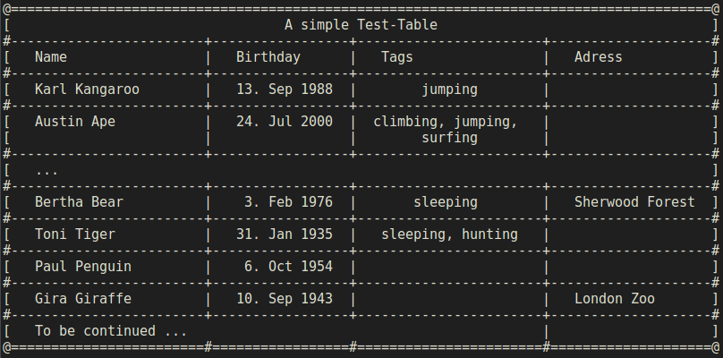

# TermTab

TermTab is a free C++ library to generate ASCII tables, simple and feature rich.

## Setup

Download the sources

    $ git clone https://github.com/Bornageek/terminal-table

and add them to your build path.

## Usage

For usage examples have a look at [test.cpp](./src/test.cpp).

## Screenshots

## ToDos

- [ ] Proper rendering of bottom separator.
- [ ] Improve header separation.
- [ ] Allow column span of empty cells.
- [ ] Implement error handling.

## License

